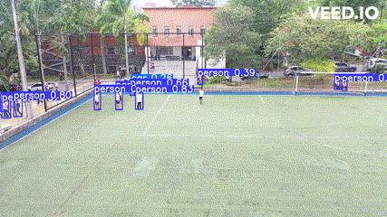
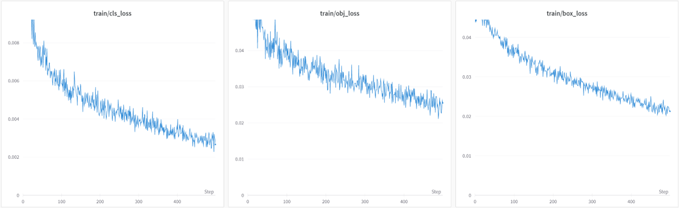
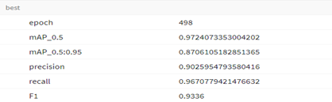

<center>  </center>

# Reconocimiento De Personas

Este repositorio contiene el código para el proyecto de grados presentado con fin de obtener el título de Ingeniero de software en la [Institución Universitaria Pascual Bravo](https://pascualbravo.edu.co/) (IUPB).

## Objetivo

Este proyecto pretende realizar la detección de personas en tiempo real, reentrenando la red neuronal [YOLOv5](https://github.com/ultralytics/yolov5)

## Instalación 

Para realizar la instalación es necesaria la instalación de algunos paquetes específicos según sea el tipo de entorno que se empleará. En nuestro caso, los modelos se entrenaron en un servidor de alto desempeño en la IUPB de base Ubuntu, y también en la plataforma [Jetson Nano](https://developer.nvidia.com/embedded/jetson-nano-developer-kit) de NVIDIA, a continuación se indica el proceso de instalación para ambos.

### Ubuntu 22.04

Clone el repositorio e instale [requirements_ubuntu] en un entorno [Python>=3.7](https://www.python.org/), cargue el archivo [requirements_ubuntu]
```
git clone https://github.com/ultralytics/yolov5  # clone
cd yolov5
pip install -r requirements_ubuntu.txt  # install
```
### Jetson Nano

Clone el repositorio e instale [requirements_jetson] en un entorno [Python=3.6.9](https://www.python.org/), cargue el archivo [requirements_jetson]
```
git clone https://github.com/ultralytics/yolov5  # clone
cd yolov5
pip install -r requirements_jetson.txt  # install
```
## Modelos preentrenados

Los modelos preentrenados como resultado de este trabajo pueden encontrarse en la carpeta ```Modelos```:

| Modelo | Descripción |
| --- | --- |
| ```best.pt``` | Este archivo almacena los valores de los pesos de todas las capas del modelo después de un entrenamiento exitoso. Este fue el resultado del entrenamiento arrojado con las instalaciones de [requirements_ubuntu]|
| ```bestJetson.pt``` | Este archivo almacena los valores de los pesos de todas las capas del modelo después de un entrenamiento exitoso. Este fue el resultado del entrenamiento arrojado con el las instalaciones de [requirements_jetson]|

## Entrenamiento 
**⚠️** Para el entrenamiento de los modelos es necesario descargar la base de datos [MS-COCO](https://cocodataset.org/#home). Antes de ejecutar el entrenamiento, asegúrese de que puede descargar los datos correspondientes

Entrene un modelo YOLOv5s en COCO128 especificando el conjunto de datos, tamaño del lote, tamaño de la imagen preentrenado ```yolov5s.pt```
```
python train.py --img 640 --batch 16 --epochs 500 --data coco128.yaml --weights yolov5s.pt --cache ram
```

<!--- 
Alejo, por favor expande esta parte o ponla un poco más específica. Piensa en que la idea de esto es que otra persona vea este repositorio y pueda replicar paso a paso todo lo que hiciste para reentrenar yolo como lo reentrenaste. Eso se llama reproducibilidad y es la idea de compartir código --->

**⚠️** Para el entrenamiento de los modelos es necesario descargar la base de datos [MS-COCO](https://cocodataset.org/#home). Antes de ejecutar el entrenamiento, asegúrese de que puede descargar los datos correspondientes

Para el entrenamiento del un modelo YOLOv5s en COCO128, es necesario especificar el conjunto de datos y el tamaño del lote y el archivo preentrenado (```yolov5s.pt```), por ejemplo: 

```
python train.py --img 640 --batch 16 --epochs 500 --data coco128.yaml --weights yolov5s.pt --cache ram
```

Si no descargo previamente la base de datos [MS-COCO](https://cocodataset.org/#home), puede dirigirse a la carpeta data y modificar el archivo ```coco.yaml```, agregando la ruta del path donde se encuentran los archivos

```
python train.py --img 640 --batch 16 --epochs 500 --data coco.yaml --weights yolov5s.pt --cache ram
```


## Detección en tiempo real

El comando de ejecución para probar los códigos, este puede ser usado para capturas en tiempo real o videos de la siguiente manera

```
python3 PedestrianRecognition.py
```

## Resultados

<!--
Incluír las curvas de los losses. También sería muy bueno crear algunos gifs de los videos del Pascual e incluirlos abajo.
-->
<center>  </center>

<center>  </center>
Valores de las diferentes métricas de loss obtenidas durante el entrenamiento del modelo no son muy altos, lo que indica que el modelo está aprendiendo bien y que el proceso de entrenamiento está funcionando correctamente.

### Desempeño

<center>  </center>
Se puede notar que los resultados obtenidos por la red neuronal en la detección de peatones fueron un éxito, dado que se logró una precisión de 0.90 y un recall de 0.96.
La precisión indica la proporción de resultados positivos verdaderos, Es decir, se logró que el 90% de las detecciones marcadas como peatones por la red neuronal fueran realmente peatones. Por otro lado, el recall indica la proporción de resultados positivos verdaderos En este caso, se logró que la red neuronal detectara el 96% de los peatones presentes en la imagen. 

### Ejemplos


## Agradecimientos

Agradecimientos especiales al [programa de internacionalización Delfin](https://www.programadelfin.org.mx/sitio/estudiantes-intercultural.php) y al [Tecnológico de Estudios Superiores de Jocotitlán](https://tesjo.edomex.gob.mx/) por permitirme comenzar este trabajo en el marco de un intercambio académico, especialmente a los profesores Rubén Fonnegra, Juan Carlos Briñez <!-- profesor de méxico!-->.
Quiero expresar mi más sincero agradecimiento a los docentes de acompañamiento de la institución universitaria Pascual Bravo, Rubén Fonegra y Juan Carlos Briñez. Su dedicación, apoyo y guía han sido fundamentales en mi desarrollo académico y personal. Gracias a su compromiso, he podido crecer y alcanzar mis metas.

También quiero agradecer al programa de internacionalización Delfin y al Tecnológico de Estudios Superiores de Jocotitlán. Su iniciativa de promover intercambios académicos y culturales ha brindado una invaluable oportunidad para ampliar mis horizontes y enriquecer mi experiencia educativa. Estoy profundamente agradecido por la oportunidad de haber participado en este programa.

Este repositorio ha sido creado y construido con el apoyo de la [Institución Universitaria Pascual Bravo](https://pascualbravo.edu.co/) (IUPB) y está basado en el repositorio de [YOLOv5](https://github.com/ultralytics/yolov5). 
Agradezco sinceramente a Rubén Fonegra, Juan Carlos Briñez y al programa "Delfin" por su compromiso, dedicación y por brindarme la posibilidad de crecer y aprender en un entorno académico enriquecedor. Sus contribuciones han sido de gran valor y han dejado una huella significativa en mi trayectoria educativa.

Este repositorio está basado en [YOLOv5](https://github.com/ultralytics/yolov5). 


## Licencia

<!--
Este tema lo podemos tratar. Yo sugeriría CC-BY-NC 4.0, pero podemos mirarlo luego.
-->


## Contacto:

**🗣️** [Alejandro Ruíz](https://github.com/AlejoRuiz) \
**🗣️** [Rubén Fonnegra](https://github.com/rubenfonnegra) (Asesor) 
**🗣️** [Juan Carlos Bríñez](https://www.researchgate.net/profile/Juan-Brinez-De-Leon) (Asesor) 
